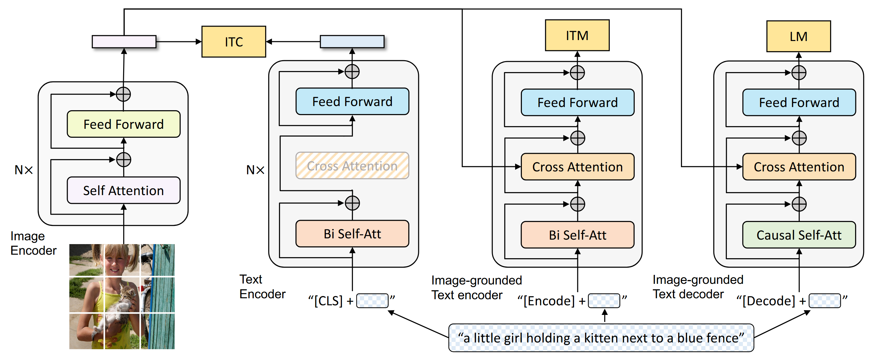
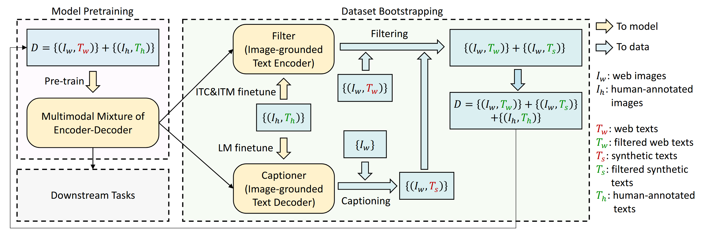

# BLIP

BLIP 是 Salesforce 团队在多模态领域中的经典工作，其影响力巨大，BLIP 系列包括：BLIP、BLIP-2、InstructBLIP。

## BLIP

在多模态大模型之前，多模态领域中最流行的是**视觉-语言预训练**（Vision-Language Pre-training, VLP）方法，而 BLIP 是其中一个具有代表性的 VLP 框架，BLIP 在模型和数据方面进行了改进。

在模型层面，采用**编码器-解码器多模态混合架构**（Multimodal mixture of Encoder-Decoder, MED），根据不同应用场景，MED 可以充当一个**单模态编码器**、**基于图像的文本编码器**或**基于图像的文本解码器**。在数据层面，使用 BLIP 对有噪声的数据进行优化，提升预训练数据的质量，同时在优化的数据上对 BLIP 进行训练。

### 模型结构

BLIP 采用 MED 模型，包括一个图像编码器： Vision Transformer(ViT)，以及可作为文本编码器和解码器的混合文本 Transformer。MED 模型结构如下图所示，在混合文本 Transformer 的每一个 Transformer 层中，存在三个子层，分别为：双向自注意力层/因果自注意力层、编码器-解码器注意力层、前馈神经网络层。

MED 是一个多任务模型，同时具有理解能力和生成能力，可以充当以下功能：

- **单模态编码器**：对文本进行编码，与 BERT 模型一致，附加的 [CLS] token 用来对文本进行总结，**代表文本的全局特征**，对图片进行编码，与 ViT 模型一致，附加的 [CLS] token 用来对图像进行总结，**代表图像的全局特征**。
- **基于图像的文本编码器**：相对于单模态编码器，在双向自注意力层和前馈神经网络层之间注入了**编码器-解码器注意力层**，用于注入图像的特征，附加的 [Encode] token 作为**图像-文本对的特征表示**。
- **基于图像的文本解码器**：将基于图像的文本编码器中的每一层 Transformer 层中的双向自注意力层替换为**因果自注意力层**，同时通过编码器-解码器注意力层，注入图像信息，使模型能够根据图像生成相关的文本，附加的 [Decode] token 表示句子的开头。

> [!NOTE]
>
> - ViT 的核心思想是将图片切分成等大小的 patch，对这些 patch 进行 input embedding 后得到一系列的视觉 tokens，附加上一个 [CLS] token，经过若干层 Transformer 编码器层，[CLS] token 的 output embedding 用来进行图像分类，[CLS] token 用来对图片进行总结，**代表图像的全局特征**。
> - 对于文本解码任务，为了保证自回归生成的性质，需要采用因果自注意力层，保证前面生成的 token 不能注意到后面生成的 token。

### 预训练目标

为了使模型同时具备理解和生成能力，BLIP 采用了多个训练目标，包括两个基于理解的任务和一个基于生成的任务，对应着三个损失函数，分别为：**图像-文本对比损失**（Image-Text Contrastive Loss, ITC），**图像-文本匹配损失**（Image-Text Matching Loss, ITM），以及**语言建模损失**（Language Modeling Loss, LM）。对于一个图像-文本对，需要通过 ViT 一次前向传播，通过文本 Transformer 三次前向传播。

- **图像-文本对比损失**：类似于 CLIP，基于**对比学习**（Contrastive Learning），其核心思想是尽可能拉近正样本对的距离，远离负样本对的距离。正样本对指的是相匹配的图像-文本对，负样本则指的是不匹配的图像-文本对。
- **图像-文本匹配损失**：对应一个**二分类任务**，输出一个概率值，表示图像和文本匹配的概率。
- **语言建模损失**：对应一个**自回归生成任务**，基于输入的图像和文本生成相关的文本。

### 学习框架

由于人工数据标注需要耗费大量的资源，因此高质量的标注数据（例如 COCO 数据集）的数量有限。

## BLIP-2

### InstructBLIP

## Reference

1. [BLIP: Bootstrapping Language-Image Pre-training for Unified Vision-Language Understanding and Generation](https://arxiv.org/abs/2201.12086) (Feb. 15, 2022, **ICML 2022**)
2. [BLIP-2: Bootstrapping Language-Image Pre-training with Frozen Image Encoders and Large Language Models](https://arxiv.org/abs/2301.12597) (Jun. 15, 2023, **ICML 2023**)
3. [InstructBLIP: Towards General-purpose Vision-Language Models with Instruction Tuning](https://arxiv.org/abs/2305.06500) (May. 11, 2023, **NeurIPS 2023**)
4. [Learning Transferable Visual Models From Natural Language Supervision](https://arxiv.org/abs/2103.00020) (Feb. 26, 2021, **ICML 2021**)
5. [BERT: Pre-training of Deep Bidirectional Transformers for Language Understanding](https://arxiv.org/abs/1810.04805) (May. 24, 2019, **ACL 2019**)

