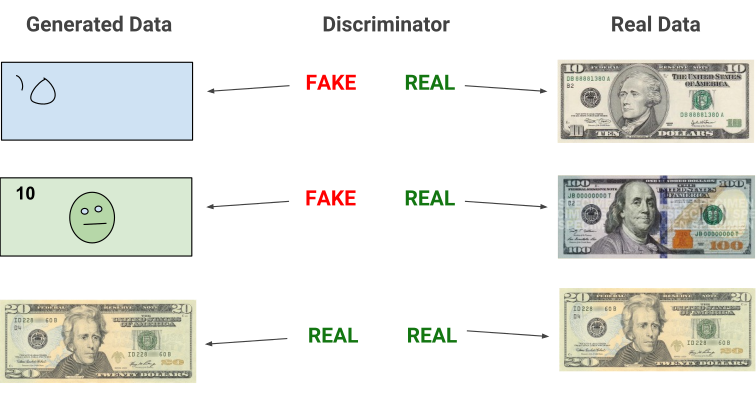
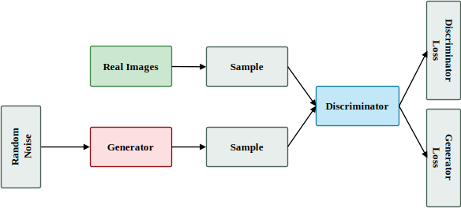
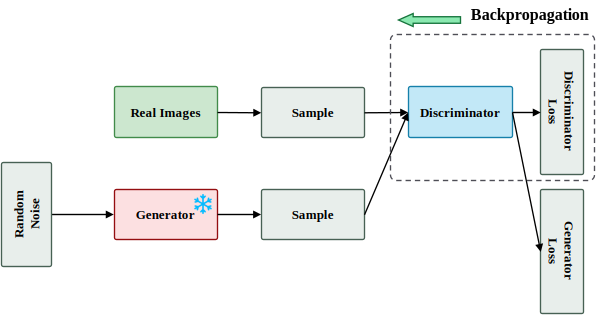
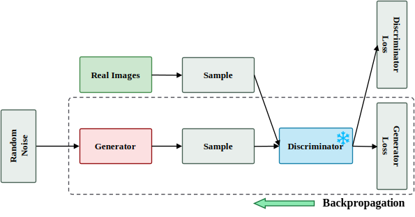
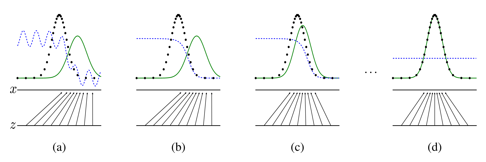
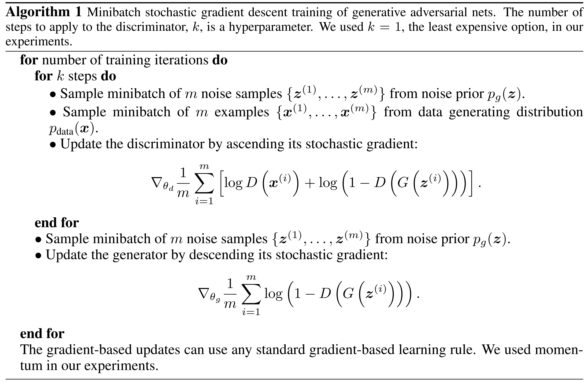

# GAN

2014 年，Ian Goodfellow 等人提出**生成对抗网络**（Generative Adversarial Networks），GAN 的出现是划时代的，虽然目前主流的图像/视频生成模型是**扩散模型**（Diffusion Models）的天下，但是我们仍然有必要了解 GAN 的思想。

GAN 的**核心思想**是训练两个模型，分别为**生成器**（Generator）和**辨别器**（Discriminator），生成器的目标是生成虚假的数据，尽可能混淆辨别器，使其无法判别真实数据和虚假数据，而辨别器的目标则是尽可能将真实数据和虚假数据区分开来。这个过程如下图所示：

生成器和辨别器处于一个对抗的过程，它们的能力不断地提升。GAN 的一个缺点在于它的训练过程不稳定，因此在 GAN 出来后，跟 GAN 相关的论文层出不穷，包括改进 GAN 的损失函数、训练方式，或者采用更先进的模型结构，使 GAN 的生成能力更强，同时使其训练过程更加稳定，但是 GAN 的核心思想是不变的。

## 模型结构

GAN 的结构如下图所示：

GAN 的生成器和辨别器是两个独立的模型，在原始 GAN 中采用的生成器和辨别器都是**多层感知机**（Multi Layer Perceptron），后来出现了许多模型结构的改进，例如 DCGAN 将 MLP 替换为卷积神经网络。

### 辨别器

辨别器本质上是一个**分类器**，用于区分真实数据和由生成器生成的虚假数据，输出是一个 0-1 范围的标量，表示为真实数据的概率值。辨别器有**两个数据来源**：真实和虚假数据，训练辨别器的过程中，保持生成器的参数不变，利用二分类损失计算梯度，执行反向传播更新辨别器的参数，过程如下。

### 生成器

生成器用于**生成虚假数据**，尽可能混淆辨别器，生成器接受一个**随机噪声**（Random Noise），随机噪声的采样可以来自于均匀分布、正态分布等等，甚至可以是一张图片。生成器的作用就是将随机噪声分布转换为真实数据的分布，在生成器训练的过程中，保持辨别器的参数不变，利用辨别器的梯度来更新生成器。

## 损失函数

GAN 采用了 minimax 损失，其数学表达式如下：

$$
\min_G \max_D V(D,G)=E_{x\sim p_{data}(x)}(\log D(x)) +E_{z\sim p_z(z)}(\log(1-D(G(z))))
$$

其中， $V(D,G)$ 表示价值函数， $x$ 为真实数据采样的样本， $z$ 为生成器生成的样本。

minimax 损失本质上是一个**二分类损失**（Binary Cross Entropy），可以拆解为辨别器损失和生成器损失。

在训练辨别器的过程中，生成器参数保持不变，因此对于辨别器而言，\\(G(z)\\) 可以视为常数，其损失函数为：

$$
L_D=-E_{x\sim p_{data}(x)}(\log D(x))-E_{z\sim p_z(z)}(\log(1-D(G(z))))
$$

在训练生成器的过程中，辨别器参数保持不变，因此对于辨别器而言，价值函数的第一项为常数，在求导时忽略不计，因此生成器的损失函数为：

$$
L_G=-E_{z\sim p_z(z)}(\log(D(G(z))))
$$

对于上述两个损失函数一个直观的理解是，对于 $L_G$ 而言，我们希望生成器生成的假数据使判别器无法区分，即希望判别器输出的概率接近于 1，**取对数后即接近于 0**，由于判别器的输出在于 0 - 1 之间，因此取 log 后为负数，即转变为最大化对数概率，或**最小化负对数概率**，由于优化的过程通常是梯度下降的过程，因此选择后者。

在 GAN 的论文中，给出了一张用于阐述 GAN 的训练过程的图。假设随机噪声 $z$ 采样自一维均匀分布，真实数据分布为标准正态分布。图中的黑色点线表示真实数据分布，蓝色虚线表示辨别器输出的概率分布，绿色实线表示生成器输出的概率分布。随着 GAN 的不断训练，生成器生成的数据分布逐渐接近于真实数据分布，辨别器越来越难以区分真实数据和假数据，因此**在理想情况下**，生成器完全学习到了真实数据分布，辨别器再也无法进行区分，因此输出的概率都为 **50%**，也就是图(d) 所示的直线。

## GAN 的训练过程以及 PyTorch 实现

以下是原始 GAN 论文中的训练算法：

**注意**：这里生成器的损失函数并不是前面重写的形式，但是它们两个是等价的，在实际中，作者采用前面重写的形式，因为他们认为这样训练更加稳定。实际的情况是都不那么稳定:)。

