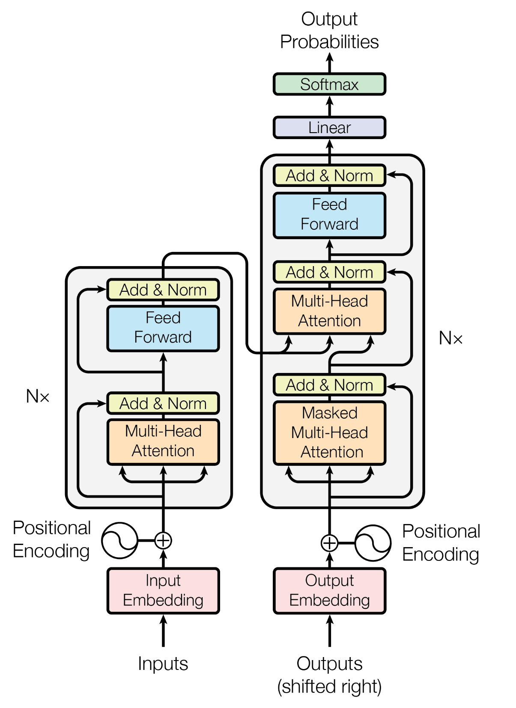
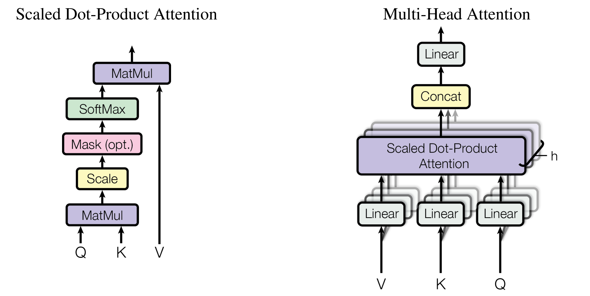

# Transformer

2017 年，谷歌团队提出 Transformer 结构，Transformer 首先应用在**自然语言处理**领域中的**机器翻译**任务上，Transformer 结构完全构建于**注意力机制**，完全丢弃递归和卷积的结构，这使得 Transformer 结构效率更高。迄今为止，Transformer 广泛应用于深度学习的各个领域。


## 模型架构

Transformer 结构如下图所示，Transformer 遵循**编码器-解码器**（Encoder-Decoder）的结构，每个 Transformer  Block 的结构**基本上相同**，其编码器和解码器可以视为**两个独立的模型**，例如：ViT 仅使用了 Transformer 编码器，而 GPT 仅使用了 Transformer 解码器。



### 编码器

编码器包含 $N=6$ 个相同的层，每个层包含两个子层，分别是**多头自注意力层**（Multi Head Self-Attention）和**前馈神经网络层**（Feed Forward Network），每个子层都包含**残差连接**（Residual Connection）和**层归一化**（Layer Normalization），使模型更容易学习。FFN 层是一个两层的**多层感知机**（Multi Layer Perceptron）。


### 解码器

解码器也包含 $N=6$ 个相同的层，包含三个子层，分别是**掩码多头自注意力层**（Masked Multi-Head Attention）、**编码器-解码器多头注意力层**（Cross Attention）和前馈神经网络层。

其中，掩码多头自注意力层用于将输出的 token 进行编码，在应用注意力机制时存在一个**注意力掩码**，以保持**自回归**（Auto Regressive）特性，即先生成的 token 不能注意到后生成的 token，编码后作为 Cross Attention 层的 Query，而 Cross Attention 层的 Key 和 Value 来自于编码器的输出，最后通过 FFN 层产生解码器块的输出。


### 位置编码

与**递归神经网络**（Recurrent Neural Networks）以串行的方式处理序列信息不同，注意力机制本身不包含位置关系，因此 Transformer 需要为序列中的每个 token 添加位置信息，因此需要位置编码。Transformer 中使用了**正弦位置编码**（Sinusoidal Position Embedding），位置编码由以下数学表达式给出：

$$
\begin{aligned}
&PE_{pos,2i} = \sin \left( \frac{pos}{10000^{2i/d_{\text{model}}}} \right)\newline
&PE_{pos,2i+1} = \cos \left( \frac{pos}{10000^{2i/d_{\text{model}}}} \right)
\end{aligned}
$$

其中，pos 为 token 所在的序列位置，i 则是对应的特征维度。作者采用正弦位置编码是基于正弦位置编码可以使模型更容易学习到相对位置关系的假设。

下面是正弦位置编码的 PyTorch 实现代码：

```python
class PositionEmbedding(nn.Module):
    """Sinusoidal Positional Encoding."""

    def __init__(self, d_model: int, max_len: int) -> None:
        super(PositionEmbedding, self).__init__()
        self.pe = torch.zeros(max_len, d_model, requires_grad=False)
        factor = 10000 ** (torch.arange(0, d_model, step=2) / d_model)
        pos = torch.arange(0, max_len).float().unsqueeze(1)
        self.pe[:, 0::2] = torch.sin(pos / factor)
        self.pe[:, 1::2] = torch.cos(pos / factor)

    def forward(self, x: Tensor) -> Tensor:
        seq_len = x.size()[1]
        pos_emb = self.pe[:seq_len, :].unsqueeze(0).to(x.device)
        return pos_emb
```


## 注意力机制

注意力机制出现在 Transformer 之前，包括两种类型：加性注意力和乘性注意力。Transformer 使用的是**乘性注意力**，这也是最常见的注意力机制，首先计算一个**点积相似度**，然后通过 Softmax 后得到**注意力权重**，根据注意力权重对 Values 进行加权求和，具体的过程可以表示为以下数学公式：

$$
\text{Attention}(Q,K,V)=\text{softmax}(\frac{QK^T}{\sqrt{d_k}})V
$$



其中，注意力计算中包含了一个**温度参数** $\sqrt{d_k}$ ，一个直观的解释是避免点积的结果过大或过小，导致 softmax 后的结果梯度几乎为 0 的区域，降低模型的收敛速度。对于自回归生成任务而言，我们不希望前面生成的 token 关注后面生成 token，因此可能会采用一个**下三角的 Attention Mask**，掩盖掉 attention 矩阵的上三角部分，注意力机制可以重写为：

$$
\text{Attention}(Q,K,V)=\text{softmax}(\frac{QK^T}{\sqrt{d_k}}+M)V
$$

具体实现中，需要 mask 掉的部分设置为负无穷即可，这会使得在 softmax 操作后得到的注意力权重为 0，避免注意到特定的 token。

有趣的是，注意力机制本身**不包含可学习参数**，因此，在 Transformer 中引入了**多头注意力**机制，同时希望多头注意力能够捕捉多种模式，类似于卷积。多头注意力机制可以表示为：

$$
\begin{aligned}
\text{MultiHead}(Q,K,V)=\text{Concat}(\text{head}_1,\text{head}_2,\dots,\text{head}_h)W^O\\
\text{where }\text{head}_i=\text{Attention}(QW_i^Q,KW_i^K,VW_i^V)
\end{aligned}
$$

以下为多头注意力机制的 PyTorch 实现代码：

```python
from torch import nn, Tensor
from functools import partial

class MultiHeadAttention(nn.Module):
    """Multi-Head Attention."""

    def __init__(self, d_model: int, n_heads: int) -> None:
        super(MultiHeadAttention, self).__init__()
        self.n_heads = n_heads
        self.proj_q = nn.Linear(d_model, d_model)
        self.proj_k = nn.Linear(d_model, d_model)
        self.proj_v = nn.Linear(d_model, d_model)
        self.proj_o = nn.Linear(d_model, d_model)
        self.attention = ScaledDotProductAttention()

    def forward(
        self, q: Tensor, k: Tensor, v: Tensor, mask: Tensor | None = None
    ) -> Tensor:
        # input tensor of shape (batch_size, seq_len, d_model)
        # 1. linear transformation
        q, k, v = self.proj_q(q), self.proj_k(k), self.proj_v(v)
        # 2. split tensor by the number of heads
        q, k, v = map(partial(_split, n_heads=self.n_heads), (q, k, v))
        # 3. scaled dot-product attention
        out = self.attention(q, k, v, mask)
        # 4. concatenate heads
        out = _concat(out)
        # 5. linear transformation
        return self.proj_o(out)


class ScaledDotProductAttention(nn.Module):
    """Scaled Dot-Product Attention."""

    def __init__(self) -> None:
        super(ScaledDotProductAttention, self).__init__()
        self.softmax = nn.Softmax(dim=-1)

    def forward(
        self, q: Tensor, k: Tensor, v: Tensor, mask: Tensor | None = None
    ) -> Tensor:
        # input tensor of shape (batch_size, n_heads, seq_len, d_head)
        d_k = k.size()[3]
        k_t = k.transpose(2, 3)
        # 1. compute attention score
        score: Tensor = (q @ k_t) * d_k**-0.5
        # 2. apply mask(optional)
        if mask is not None:
            score = score.masked_fill(mask == 0, float("-inf"))
        # 3. compute attention weights
        attn = self.softmax(score)
        # 4. compute attention output
        out = attn @ v
        return out


def _split(tensor: Tensor, n_heads: int) -> Tensor:
    """Split tensor by the number of heads."""
    batch_size, seq_len = tensor.size()[:2]
    d_model = tensor.size()[2]
    d_head = d_model // n_heads
    return tensor.view(batch_size, seq_len, n_heads, d_head).transpose(1, 2)


def _concat(tensor: Tensor) -> Tensor:
    """Concatenate tensor after splitting."""
    batch_size, n_heads, seq_len, d_head = tensor.size()
    d_model = n_heads * d_head
```


## Reference

1. [Attention is All you Need](https://arxiv.org/abs/1706.03762) (Jul. 12, 2017)[](https://arxiv.org/abs/1706.03762)[](https://github.com/tensorflow/tensor2tensor)
