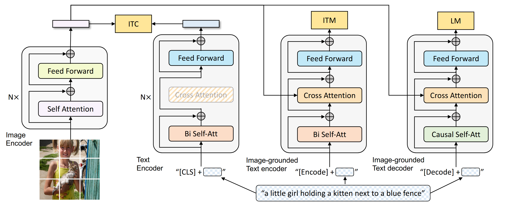
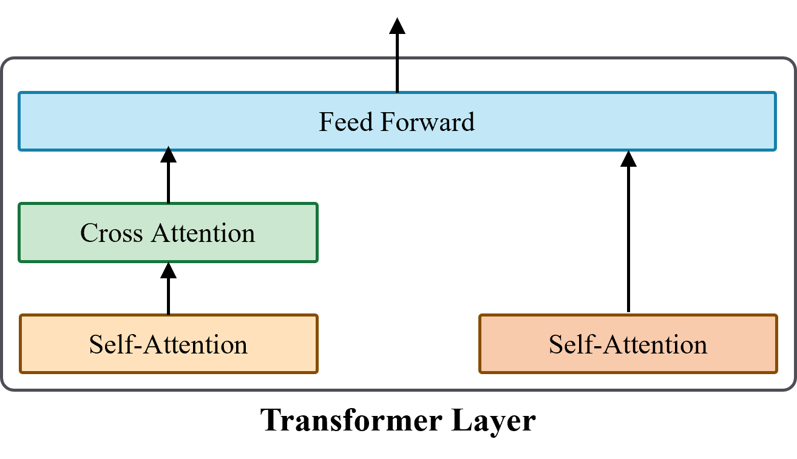
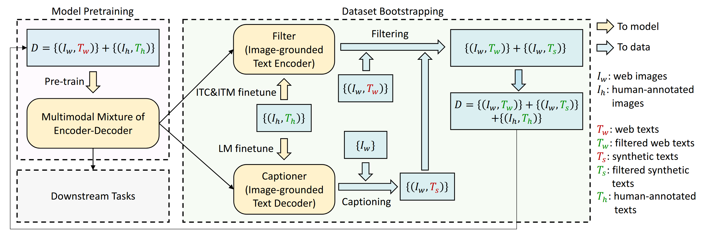
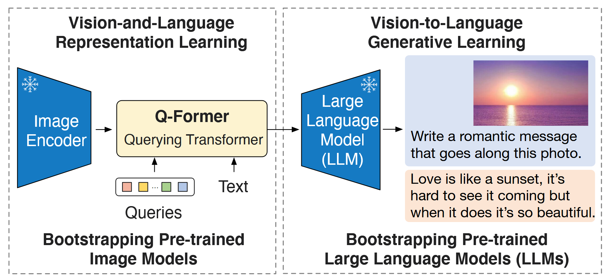
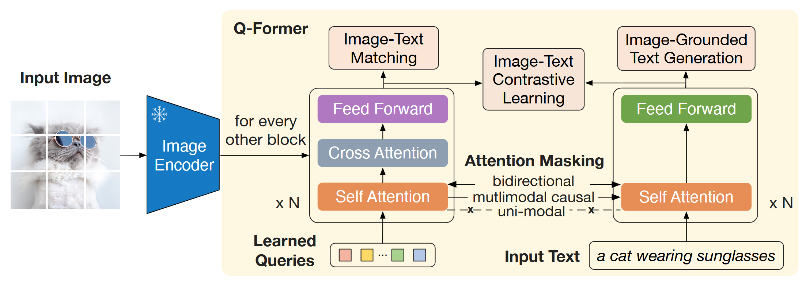
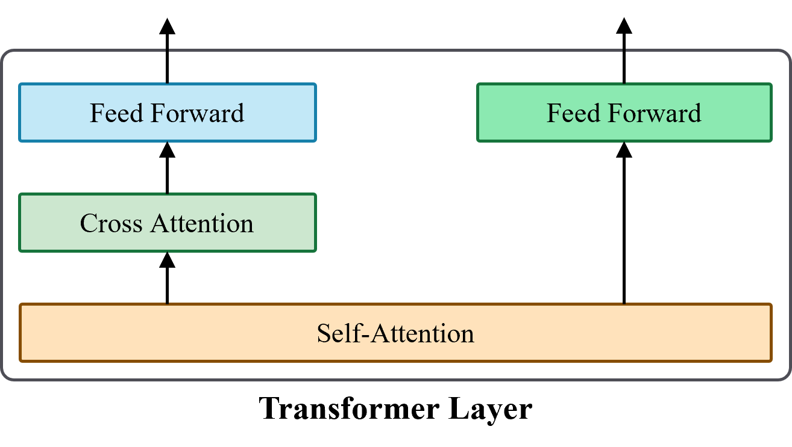
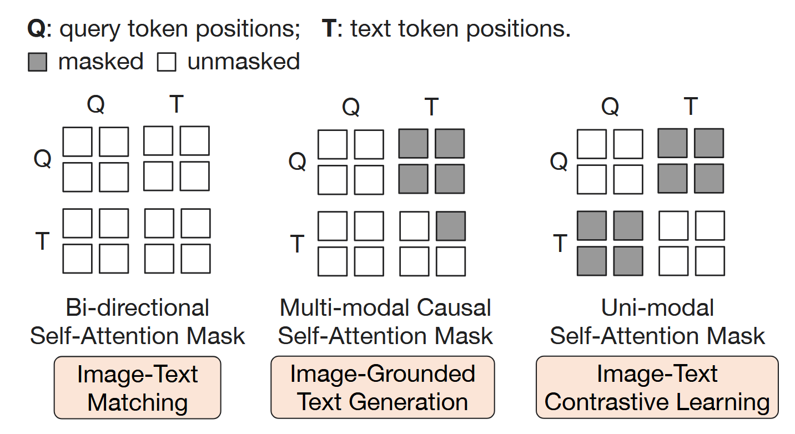
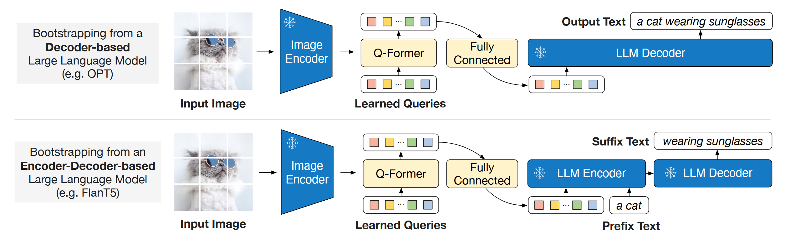
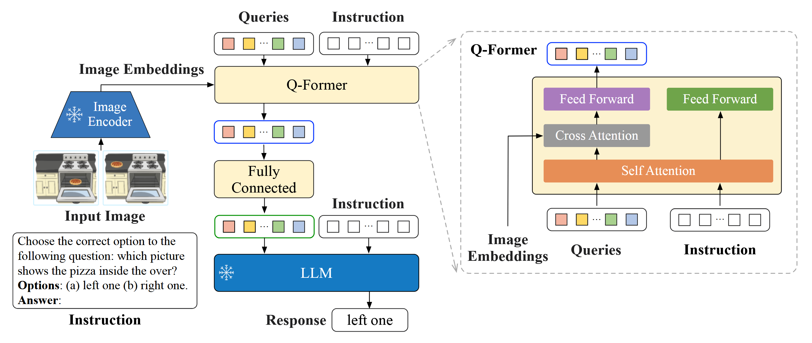
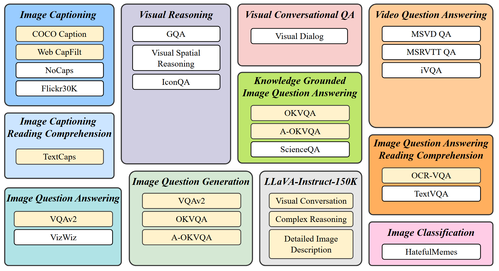

# BLIP

BLIP 是 Salesforce 团队在多模态领域中的经典工作，影响力巨大，BLIP 系列包括：BLIP、BLIP-2、InstructBLIP。

## BLIP

在多模态大模型之前，多模态领域中最流行的是**视觉-语言预训练**（Vision-Language Pre-training, VLP）方法，而 BLIP 是其中一个具有代表性的 VLP 框架，BLIP 在模型和数据方面进行了改进。

在模型层面，采用**编码器-解码器多模态混合架构**（Multimodal mixture of Encoder-Decoder, MED），根据不同应用场景，MED 可以充当一个**单模态编码器**、**基于图像的文本编码器**或**基于图像的文本解码器**。在数据层面，使用 BLIP 对有噪声的数据进行优化，提升预训练数据的质量，同时在优化的数据上对 BLIP 进行训练。

### 模型结构

BLIP 采用 MED 模型，包括一个图像编码器： Vision Transformer(ViT)，以及可作为文本编码器和解码器的混合文本 Transformer。MED 模型结构如下图所示，在混合文本 Transformer 的每一个 Transformer 层中，存在三个子层，分别为：双向自注意力层/因果自注意力层、编码器-解码器注意力层、前馈神经网络层。

MED 是一个多任务模型，同时具有理解能力和生成能力，可以充当以下功能：

- **单模态编码器**：对文本进行编码，与 BERT 模型一致，附加的 [CLS] token 用来对文本进行总结，**代表文本的全局特征**，对图片进行编码，与 ViT 模型一致，附加的 [CLS] token 用来对图像进行总结，**代表图像的全局特征**。
- **基于图像的文本编码器**：相对于单模态编码器，在双向自注意力层和前馈神经网络层之间注入了**编码器-解码器注意力层**，用于注入图像的特征，附加的 [Encode] token 作为**图像-文本对的特征表示**。
- **基于图像的文本解码器**：将基于图像的文本编码器中的每一层 Transformer 层中的双向自注意力层替换为**因果自注意力层**，同时通过编码器-解码器注意力层，注入图像信息，使模型能够根据图像生成相关的文本，附加的 [Decode] token 表示句子的开头。

> [!NOTE]
>
> - ViT 的核心思想是将图片切分成等大小的 patch，对这些 patch 进行 input embedding 后得到一系列的视觉 tokens，附加上一个 [CLS] token，经过若干层 Transformer 编码器层，[CLS] token 的 output embedding 用来进行图像分类，[CLS] token 用来对图片进行总结，**代表图像的全局特征**。
> - 对于文本解码任务，为了保证自回归生成的性质，需要采用因果自注意力层，保证前面生成的 token 不能注意到后面生成的 token。

每一个 Transformer 层的结构如下：

### 预训练目标

为了使模型同时具备理解和生成能力，BLIP 采用了多个训练目标，包括两个基于理解的任务和一个基于生成的任务，对应着三个损失函数，分别为：**图像-文本对比损失**（Image-Text Contrastive Loss, ITC），**图像-文本匹配损失**（Image-Text Matching Loss, ITM），以及**语言建模损失**（Language Modeling Loss, LM）。对于一个图像-文本对，需要通过 ViT 一次前向传播，通过文本 Transformer 三次前向传播。

- **图像-文本对比损失**：类似于 CLIP，基于**对比学习**（Contrastive Learning），其核心思想是尽可能拉近正样本对的距离，远离负样本对的距离。正样本对指的是相匹配的图像-文本对，负样本则指的是不匹配的图像-文本对。
- **图像-文本匹配损失**：对应一个**二分类任务**，输出一个概率值，表示图像和文本匹配的概率。
- **语言建模损失**：对应一个**自回归生成任务**，基于输入的图像和文本生成相关的文本。

### 学习框架

由于人工数据标注需要耗费大量的资源，因此高质量的标注数据（例如 COCO 数据集）的数量有限。许多方法采用互联网上的 image-alt 对进行训练，但这不是最优的，因为这些 image-alt 对的匹配度不一定高，因此这些数据包含噪声。

BLIP 的训练是一个迭代的过程，具体过程如下图所示。

- **模型预训练阶段**：BLIP 同时在人工标注数据集和来自于互联网包含噪声的数据集上进行预训练。
- **数据集引导阶段**：BLIP 利用人工标注数据集上进行微调，通过语言建模损失微调 MED 得到 *Captioner*，通过图像-文本对比损失和图像-文本匹配损失微调 MED 得到 *Filter*。*Captioner* 用来生成图像的文本描述，进而**生成图像-文本对**；*Filter* 用来判断图像-文本对是否匹配，进而**过滤不匹配的数据**。通过数据集引导阶段可以有效地优化数据集（**数量更多，质量更高**）。

## BLIP-2

由于大模型具有强大的生成能力以及端到端的视觉-语言预训练（VLP）的代价很高，因此在 BLIP-2 中引入了**预训练**的视觉编码器和大模型，通过一个轻量级 Querying Transformer(Q-Former) 进行**多模态对齐**。Q-Former 通过**视觉-语言表示学习**和**视觉到语言生成学习**两个阶段进行模态对齐。

### Q-Former

用于跨模态对齐的 Q-Former 是 BLIP-2 核心组件，其模型结构如下图所示（相同颜色代表的模块参数相同）。类似于 BLIP 模型，Q-Former 也是一个**混合结构**，也是通过编码器-解码器注意力（Cross Attention）注入图像特征信息，与  BLIP 模型不同之处在于：

- Q-Former 引入了一组**可学习的 Query tokens**，利用 Query tokens 提取抽象的图像特征。
- 通过不同的注意力掩码（Attention Mask）来控制信息流。

每一个 Transformer 层都是下图所示的结构：

### 视觉-语言表示学习阶段

第一个阶段的目的是引导 Q-Former 从一个预训练的图像编码器进行视觉-语言表示学习。与 BLIP 的多目标训练过程类似，Q-Former 包括三个训练目标：**图像-文本对比学习**，**图像-文本匹配学习**，以及**基于图像的文本生成学习**。
针对于不同的学习目标，采用的注意力掩码如下图所示：

- **图像-文本对比学习**：目的是通过对比学习**对齐图像和文本模态**，具体而言，Q-Former 通过 Query tokens 提取图像特征，对于文本 tokens 附加一个 [CLS] token 用于表示文本的全局特征，同时采用**单模态自注意力掩码**避免 Query tokens 与 文本 tokens 的信息交互，本质上是避免图像和文本特征的交互。若 Query tokens 的数量不止一个，那么选择与文本的 [CLS] token 的**相似度最高**的 query token 作为图像的全局特征。
- **图像-文本匹配学习**：目的是进行**细粒度图像-文本对齐**，采用**双向自注意力掩码**，允许 Query tokens 和文本 tokens 之间交互。经过 Q-Former 编码后输出的 Query tokens 通过一个两类分类器（匹配或不匹配），平均所有的 logits，将其作为图像和文本的**匹配分数**。
- **基于图像的文本生成学习**：目的是使 Q-Former 具备生成能力，采用**多模态因果自注意力掩码**，对于文本 tokens，先生成的文本 token 不能注意到后生成的 token，保证自回归性质，同时附加一个 [DEC] token，表示生成文本的开头。

### 视觉到语言生成学习阶段

第二阶段的目的是引导 Q-Former 进行视觉到语言的生成学习，Q-Former 可以视为一个视觉编码器和大模型之间的**信息瓶颈**，通过 Query tokens **提取最有用的图像信息**，Q-Former 后是一个线性投影层用于对齐特征维度。该阶段的训练目标就是**语言建模**，通过建模损失来进行反向传播获取梯度，进而更新 Q-Former 以及线性投影层的参数。

大模型分为编码器-解码器和纯解码器两种结构，在编码器-解码器结构中，将 ground-truth 的文本分为两个部分，前半部分作为 LLM 编码器的输入，后半部分用来作为生成的目标。

## InstructBLIP

InstructBLIP 采用了预训练的 Q-Former，预训练后的具备多模态对齐的能力。相对于 BLIP-2，InstructBLIP 利用 Q-Former 来**提取指令相关的视觉特征**，同时在一个更大的数据集上，使用更好的训练方式训练，取得了很好的零样本泛化性能。

### 模型结构

InstructBLIP 的模型结构如下图所示，核心的组件是 Q-Former，Query tokens 用于提取指令相关的图像特征，通过 BLIP-2 预训练的 Q-Former 进行初始化。

**指令感知特征提取**：在提取图像特征时，还会输入对应的指令特征，Query tokens 和指令 tokens 通过自注意力层进行交互，通过编码器-解码器注意力层向 Query tokens 注入图像特征，通过这种指令感知的图像特征提取方式，使得 Q-Former 可以提取到**指令最相关的图像特征**。

### 训练任务和数据集

作者将 26 个数据集分类为 11 类任务，包括图像文本描述、视觉推理等任务。同时挑选出 13 个数据集进行训练，在另外的 13 个数据集上进行测试，其中有两类任务数据集完全不参与训练，用于评估任务外的零样本泛化性能。

## Reference

1. [BLIP: Bootstrapping Language-Image Pre-training for Unified Vision-Language Understanding and Generation](https://arxiv.org/abs/2201.12086) (Feb. 15, 2022, **ICML 2022**)
2. [BLIP-2: Bootstrapping Language-Image Pre-training with Frozen Image Encoders and Large Language Models](https://arxiv.org/abs/2301.12597) (Jun. 15, 2023, **ICML 2023**)
3. [Visual Instruction Tuning](https://arxiv.org/abs/2304.08485) (Dec. 11, 2023, **NeurIPS 2023**)
4. [InstructBLIP: Towards General-purpose Vision-Language Models with Instruction Tuning](https://arxiv.org/abs/2305.06500) (May. 11, 2023, **NeurIPS 2023**)
5. [Learning Transferable Visual Models From Natural Language Supervision](https://arxiv.org/abs/2103.00020) (Feb. 26, 2021, **ICML 2021**)
6. [BERT: Pre-training of Deep Bidirectional Transformers for Language Understanding](https://arxiv.org/abs/1810.04805) (May. 24, 2019, **ACL 2019**)

