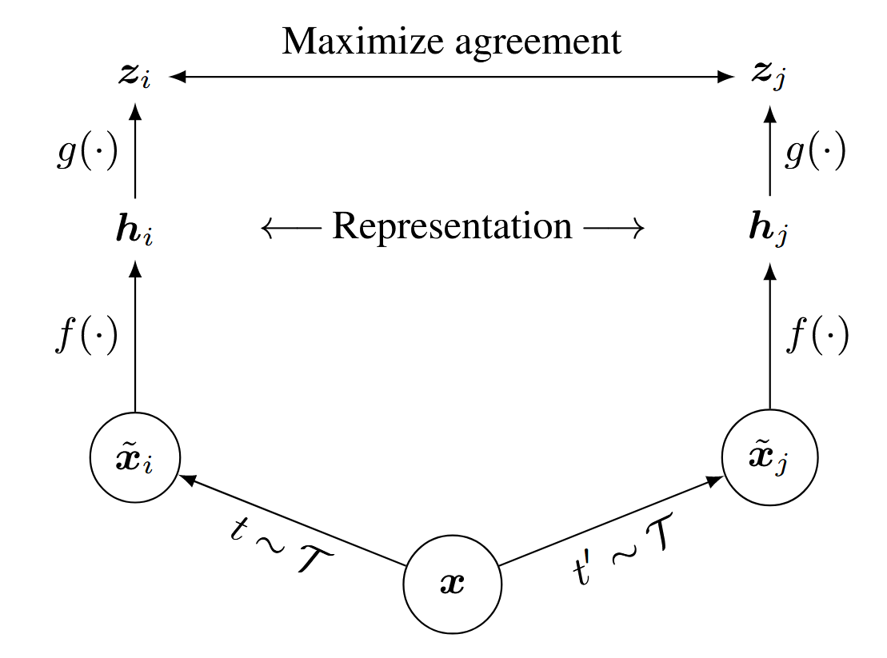
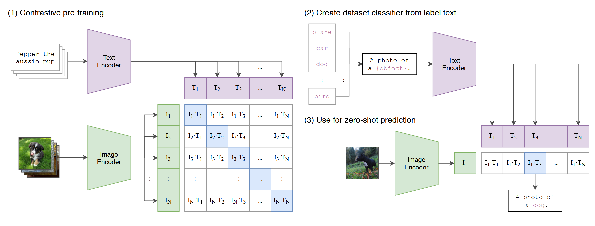

# CLIP

CLIP(Contrastive Language-Image Pretraining) 是 OpenAI 在多模态领域中非常经典、且影响力巨大的工作。CLIP 在 4 亿个图像-文本对数据集上进行**视觉-文本对齐**预训练，在 ImageNet 2012 数据集上的验证精度达到了 76.2 %。由于 CLIP 具有强大的**零样本**（zero-shot）泛化能力，后来出现了许多 CLIP 相关的工作，例如将 CLIP 应用到图像检索、分割等领域。


## 对比学习

这里简要介绍一下**对比学习**，对比学习是一种**自监督学习**（Self-supervised Learning）的方式，在对比学习中，存在着正样本、负样本、对比损失等概念。其中，**正样本表示与当前样本相关的样本，负样本则是与当前样本无关的样本**。以一个非常经典的对比学习框架 *SimCLR* 为例，SimCLR 构造正样本的方式就是利用**数据增广**（Data Augmentation）方式，例如随机缩放、随机裁剪、添加高斯噪声等等方式得到的样本就是原来图片的正样本，因为这个样本**可以看作是原样本的不同视角下观察的结果**。对比损失的形式不只一种，它们的目标都是将正样本对的距离缩小、负样本对的距离增大。




## 方法

下图摘自 CLIP 原始论文的框架图，非常清晰地阐述了 CLIP 的核心思想。



具体而言，CLIP 训练两个模型，分别为**视觉编码器**、**文本编码器**，它们分别将图片和文本进行编码，分别得到一个表示图片和文本的向量，利用**对比学习**（Contrastive Learning）进行图像-文本的对齐训练，**尽可能缩小正样本的距离，尽可能扩大负样本的距离**。

进行零样本图片分类任务时，将目标数据集的**类别**通过 "A photo of {Label}" 模板替换，利用 CLIP 的文本编码器进行编码，使用 CLIP 的视觉编码器对目标图片进行编码，直接计算向量之间的**余弦相似度**，相似度最高的类别即为预测类别。

下面是 CLIP 实现的伪代码：

```python
# image_encoder - ResNet or Vision Transformer 
# text_encoder  - CBOW or Text Transformer 
# I[n, h, w, c] - minibatch of aligned images 
# T[n, l]       - minibatch of aligned texts 
# W_i[d_i, d_e] - learned proj of image to embed 
# W_t[d_t, d_e] - learned proj of text to embed 
# t             - learned temperature parameter  

# extract feature representations of each modality
I_f = image_encoder(I) # [n, d_i]
T_f = text_encoder(T)  # [n, d_t]

# joint multimodal embedding [n, d_e]
I_e = l2_normalize(np.dot(I_f, W_i), axis=1)
T_e = l2_normalize(np.dot(T_f, W_t), axis=1)  

# scaled pairwise cosine similarities [n, n]
logits = np.dot(I_e, T_e.T) * np.exp(t)  

# symmetric loss function
labels = np.arange(n)
loss_i = cross_entropy_loss(logits, labels, axis=0)
loss_t = cross_entropy_loss(logits, labels, axis=1)
loss = (loss_i + loss_t)/2
```

代码解释如下：

1. 将图像和文本进行编码，得到图像和文本的特征向量。
2. 将特征向量线性投影，对齐特征维度。
3. 计算它们之间的**余弦相似度**。
4. 计算对比损失。

对于模型结构的选择，作者尝试了不同的模型，表现最好的是 Transformer 结构，对应的视觉编码器是 ViT、文本编码器是 BERT。


## Reference

1. [Learning Transferable Visual Models From Natural Language Supervision](https://arxiv.org/abs/2103.00020) (Feb. 26, 2021)[](https://arxiv.org/abs/2103.00020)[](https://github.com/OpenAI/CLIP)
2. [A Simple Framework for Contrastive Learning of Visual Representations](https://arxiv.org/abs/2002.05709) (Jul. 1, 2020, **ICML 2020**)[](https://arxiv.org/abs/2002.05709)[](https://github.com/google-research/simclr)
3. [BERT: Pre-training of Deep Bidirectional Transformers for Language Understanding](https://arxiv.org/abs/1810.04805) (May. 24, 2019, **ACL 2019**)[](https://arxiv.org/abs/1810.04805)[](https://github.com/google-research/bert)