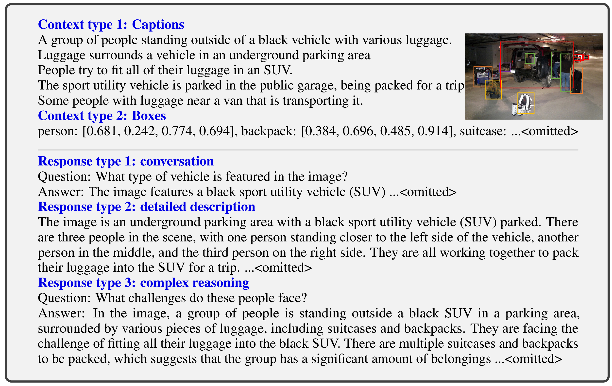
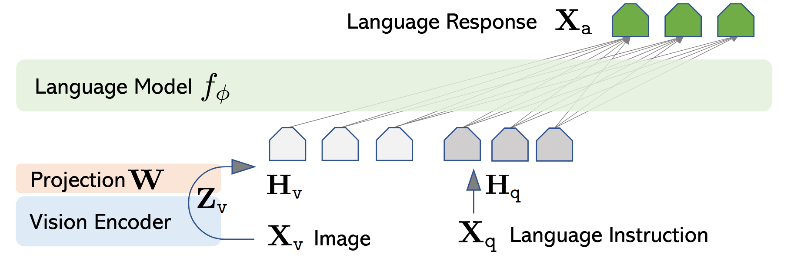
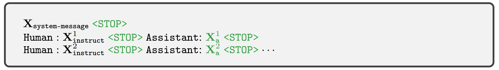
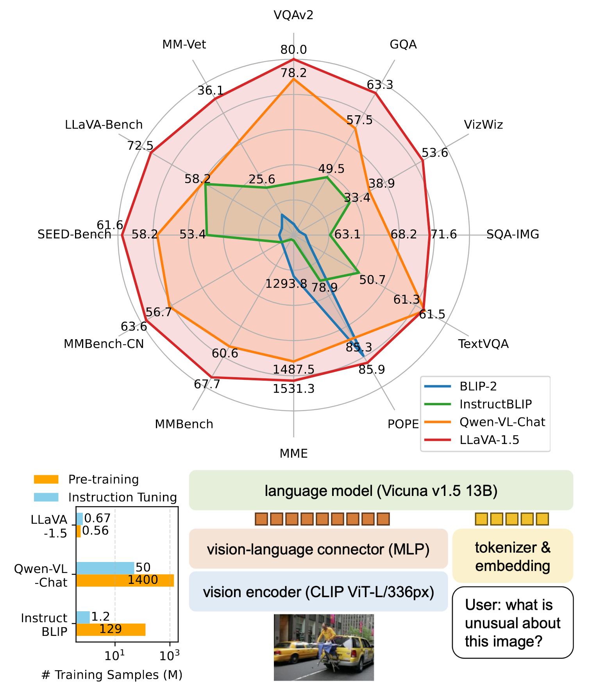
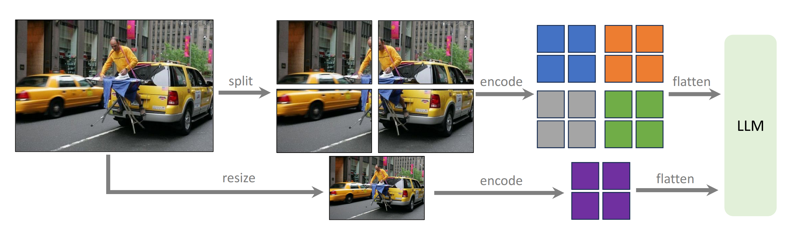

# LLaVA

LLaVA 是一个广泛使用的开源多模态大模型，是多模态大模型领域中的经典工作，也是第一个在多模态领域中应用指令微调的工作。通过指令遵循（Instruction-following）数据进行大模型**指令微调**（Instruction Tuning），能够有效地提升模型的零样本泛化性能。

## LLaVA

LLaVA 在多模态大模型中应用指令微调，利用 language-only 的 GPT-4 生成多模态指令遵循数据，并在这些数据上进行指令微调，在 ScienceQA 上取得了 SoTA 性能。

### 指令遵循数据生成

基于 COCO 数据集，利用 language-only 的 GPT-4 来生成指令遵循数据集。具体而言，输入到 GPT-4 的内容是图像相关的文本描述，包括：**图像的详细文本描述**和**目标检测结果（物体类别和边界框）的文本描述**，仿佛让 GPT 看到了图片。作者设计了一个 prompt 模板，以及少量的输入-输出样例以利用大模型的上下文学习（in-context learning）能力。对于每一个图片，让 GPT-4 生成与图片相关的问题-答案对，包括物体计数、物体类型、物体相对位置、基于图像的复杂推理等问题类型。

生成的问题-回答类型包括**多轮对话式**数据、详细**图像文本描述**以及**复杂推理**，一个指令遵循数据生成的样例如下图所示。

通过这种指令遵循数据生成方式，生成了 LLaVA-Instruct-150K 数据集。包含 150K 个样本，其中，58K 个对话式样本、23K 个图像详细文本描述样本、77K 个复杂推理样本。

### 模型结构

LLaVA 的模型结构分为三个部分：**视觉编码器、视觉-语言连接器、大模型**，是当前多模态大模型的标准结构。LLaVA 采用预训练的 OpenAI **CLIP ViT-L/14** 作为视觉编码器，因为 CLIP 通过视觉-语言对比学习进行了视觉和文本模态的对齐；视觉-语言连接器是一个轻量级的**线性投影层**，用于对齐特征维度；采用了 **Vicuna**（基于 Llama）作为其大模型组件。

### 训练过程

LLaVA 的训练是一个两阶段过程，包括：**多模态对齐预训练**、**端到端微调**。对每个图片生成多轮对话数据 $(X_q^1,X_a^2,\dots,X_q^T,X_a^T)$，其中 $T$ 为对话轮数，将它们组织为一个序列，将答案作为大模型的 ground truth 回答，并通过**语言建模损失**进行训练。第 $t$ 轮的指令为：

$$
X_{instruct}^t=\begin{cases}&\text{Randomly choose }[X_q^t,X_v]\text{ or }[X_v,X_q^t]&\text{if }t=1\newline&X_q^t&\text{otherwise}\end{cases}
$$

对于长度为 $L$ 的序列，目标答案的 $X_a$ 生成概率为：

$$
p(X_a|X_v,X_{instruct})=\prod_{i=1}^L p_\theta (x_i|X_v,X_{instruct,\lt i},X_{a,\lt i})
$$

下面是一个包含两轮对话的输入序列样例，只有**绿色的部分**（STOP 标识符和问题的 ground truth 答案）用于计算语言建模损失。

- **多模态特征对齐预训练**：在预训练阶段中，只有轻量级的线性投影层是可训练的模块，其余模块参数保持不变。作者将 CC3M 数据集过滤为 595K 个**图像-文本对**，这些文本对组织为指令遵循数据，每个样例当作一轮的对话。
- **端到端微调**：保持视觉编码器参数不变，训练大模型和线性投影层，LLaVA 考虑两种应用场景：（1）**多模态聊天机器人**；（2）**科学问答**（Science QA）数据集。

## LLaVA-1.5

相对于原始的 LLaVA，LLaVA-1.5 在模型和训练数据上进行了改进。在模型层面，采用了支持**更高分辨率**的 OpenAI **CLIP ViT-L/14-336** 模型作为 LLaVA-1.5 的视觉编码器，在作为视觉-语言连接器的线性投影层替换为**两层 MLP**；在训练数据上，添加了学术相关的数据集。通过 LLaVA 的两阶段训练过程，LLaVA-1.5 在 11 个基准测试数据集上取得了 SoTA 性能。同时，相对于其他 SoTA 的多模态大模型如 Qwen-VL-Chat、InstructBLIP，采用极少的训练数据获得了更好的性能。

除此之外，LLaVA-1.5 通过下图所示的方式扩展到更高的分辨率。具体而言，LLaVA-1.5 设定了若干个网格设定：

$$
\lbrace2\times2,1\times\lbrace2,3,4\rbrace,\lbrace2,3,4\rbrace\times1\rbrace
$$

其中，每个网格对应 336x336 的**子图**，同时对**原图**进行编码，编码的结果进行序列合并后输入到大模型中。

## Reference

1. [Improved Baselines with Visual Instruction Tuning](https://arxiv.org/abs/2310.03744) (May. 15, 2024, **CVPR  2024**)
2. [Visual Instruction Tuning](https://arxiv.org/abs/2304.08485) (Dec. 11, 2023, **NeurIPS 2023**)

