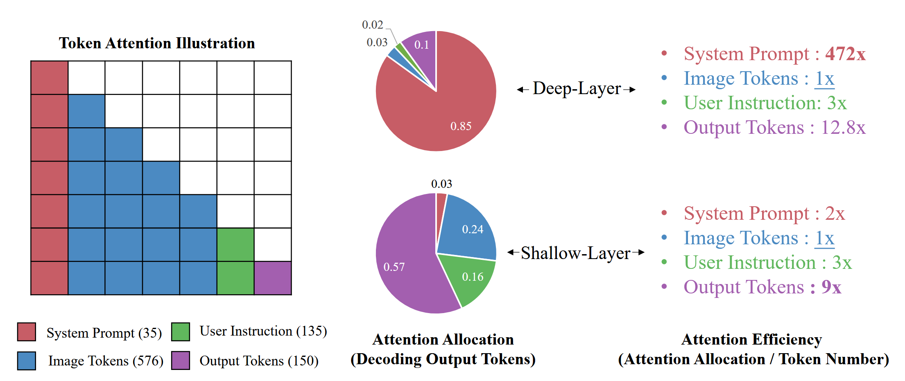
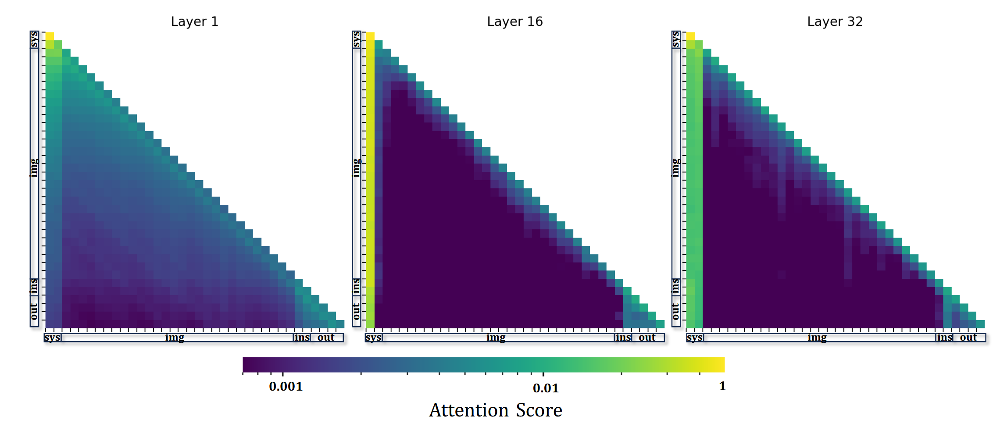
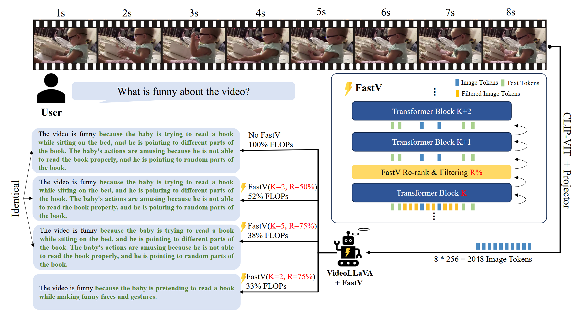

# FastV

FastV 是多模态大模型加速的经典工作，作者通过可视化大模型的注意力图（Attention Map），发现在第二层之后对于视觉 tokens 的注意力很低，说明对于视觉信息的处理十分低效，因此采用了视觉 tokens 剪枝的方式对多模态大模型进行加速。

## 低效的视觉注意力模式

一个典型的多模态大模型，大模型的输入包括四个部分：**系统提示**（System prompt）、**视觉信息**（Visual tokens）、**用户输入指令**（User Instruction）、**大模型已生成的文本输出**（Output tokens）。**注意力分配**（Attention Allocation）指标用来衡量所有 tokens 的注意力分配情况，简而言之就是**将注意力矩阵按列求和**。**注意力效率**（Attention Efficiency）指标用来衡量注意力的效率，计算方式就是注意力分配指标:heavy_division_sign: tokens 数量。

作者在一个小型数据集上，进行了测试，结果如下所示，在大模型浅层对于视觉 tokens 的注意力分配相对较高（0.24），在大模型深层对于视觉 tokens 的注意力分配极低（0.03）。结果是：虽然视觉 tokens 的数量占了输入的绝大部分（例如在 LLaVA-1.5 中包含 576 个视觉 tokens），但是**视觉 tokens 的注意力分配极低**，因此表现出对视觉信息处理的**低效**模式。

## 方法

基于多模态大模型在深层（第 2 层后）展现出的**低效视觉注意力**模式，FastV 采用视觉 tokens 剪枝的方法，在预填充（Pre-filling）阶段的第 K 层进行剪枝操作，根据 last token 的注意力矩阵，基于 last token 对视觉 token 的注意力分数进行排序，最后 *R* % 的视觉 tokens 将会被剪枝，从而有效地降低了视觉 tokens 的数量，进而达到加速的目的。

下图为 Video-LLaVA 上应用 FastV 的示例：

## Reference

1. [An Image is Worth 1/2 Tokens After Layer 2: Plug-and-Play Inference Acceleration for Large Vision-Language Models](http://arxiv.org/abs/2403.06764) (Sep. 2, 2024, **ECCV 2024**)
2. [Visual Instruction Tuning](https://arxiv.org/abs/2304.08485) (Dec. 11, 2023, **NeurIPS 2023**)
3. [Improved Baselines with Visual Instruction Tuning](https://arxiv.org/abs/2310.03744) (May. 15, 2024, **CVPR  2024**)