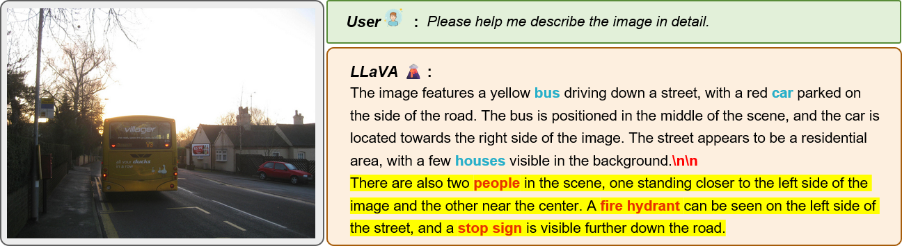

# CHAIR

**CHIAR**(Caption Hallucination Assessment with Image Relevance) 指标是评测多模态大模型**物体幻觉**的常用数据集之一，首次于 2018 年提出。CHAIR 指标**基于 MSCOCO 数据集**，面向于图像的文本描述（Image Captions）的物体幻觉评测。CHAIR 指标包含**句子级别**（Sentence-Level）和**实例级别**（Instance-Level）两个变体。

**CHAIRs** 衡量句子级别的幻觉程度：

$$
\text{CHIAR}i=\frac{|\lbrace\text{sentences with hallucinated object}\rbrace|}{|\lbrace\text{all sentences}\rbrace|}
$$

**CHAIRi** 衡量实例级别的幻觉程度：

$$
\text{CHIAR}s=\frac{|\lbrace\text{hallucinated objects}\rbrace|}{|\lbrace\text{all objects mentioned}\rbrace|}
$$

以下面的例子为例，输入 COCO 数据集中的一张[图片](http://images.cocodataset.org/val2014/COCO_val2014_000000499775.jpg)，要求 LLaVA 对图片进行详细描述。

- **实例级别幻觉**：LLaVA 的响应中包含的 COCO 数据集物体为：bus、car、houses、**people**、**fire hydrant**、**stop sign**，其中 people，fire hydrant 和 stop sign 为**幻觉词**，因此 $\text{CHAIR}s= 3/6=0.5$ 。
- **句子级别幻觉**：LLaVA 的响应包括 5 个句子，而最后两个句子包含幻觉词，因此 $\text{CHAIR}i=2/5=0.4$ 。

**注**：CHAIR 指标的值越小越好，代表着物体幻觉程度越小。

**总结**：CHAIR 指标是一个**简单且有效**:thumbsup:的物体幻觉评测指标，然而 CHAIR 指标没有考虑到细粒度的幻觉现象，例如：**物体关系和物体属性幻觉**。同时 COCO 数据集仅包含 80 个物体类别，不能很好地衡量开放世界的。

## Reference

1. [Object Hallucination in Image Captioning](https://arxiv.org/abs/1809.02156)(Sep. 6, 2018, **EMNLP 2018**) 

