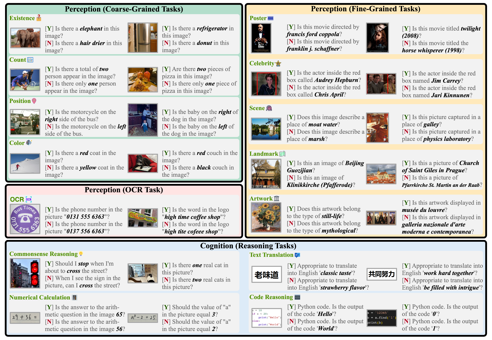

# MME

MME 是评估多模态大模型的综合性能的数据集，共计 14 个子任务，用于评价多模态大模型的**感知和推理能力**。

其中，感知任务包含：

- **粗粒度**感知：**存在性**、**物体计数**、**物体位置**、**物体颜色**。
- **细粒度**感知：**海报**、**名人**、**场景**、**地标**、**艺术品**。
- **OCR**：**光学字符识别**。

其中，推理任务包含：**常识推理**、**数值计算**、**文本翻译**、**代码推理**。

每个任务的总分为 200 分，感知任务共 10 个，满分 2000 分，推理任务共 4 个，满分 800 分。

**注**：MME 的其中 4 个感知任务：**存在性**（Existence）、**物体计数**（Count）、**物体位置**（Position）、**物体颜色**（Color），常用于**评估多模态大模型的幻觉**:t。

## Reference

1. [MME: A Comprehensive Evaluation Benchmark for Multimodal Large Language Models](https://arxiv.org/abs/2306.13394) (Jun. 23, 2023) 