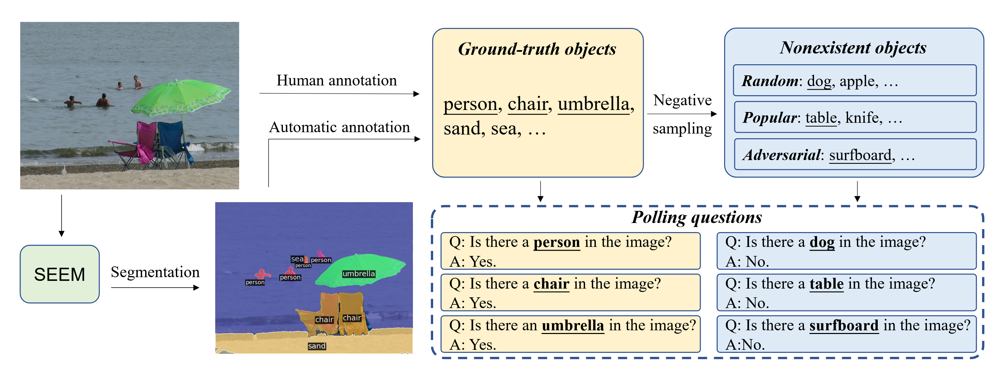

# PoPE

PoPE 是评估多模态大模型幻觉程度广泛使用的数据集之一，PoPE 数据集主要面向于衡量**物体幻觉**，给定一张图片，对应的问题模板为：`Is there a <object> in the image?`，多模态大模型只需要回答 “Yes” 或者 “No”，因此 PoPE 本质上是一个**二分类任务**，对应的评价指标为：Accuracy、Precision、Recall、F1 Score。

```math
\begin{align}
\text{Accuracy}&=\frac{TP+TN}{TP+FP+TN+FN}\newline
\text{Precision}&=\frac{TP}{TP+FP}\newline
\text{Recall}&=\frac{TP}{TP+FN}\newline
\text{F1 Score}&=2\times\frac{\text{Precision}\times\text{Recall}}{\text{Precision}+\text{Recall}}
\end{align}
```

**注**：F1 Score 是 Accuracy 和 Recall 的调和平均数，四个指标**越高越好**。

PoPE 数据集包含**三种设定**：Random、Popular、Adversarial：

- Random 设定表示问题中的物体是**随机挑选**的，可能与图片无关。
- Popular 设定表示问题中的物体是**从经常出现的物体类别中挑选的**，例如**人**（Person）。
- Adversarial 设定表示问题中的物体是**与图片相关**，通常都是一些**容易共同出现但在图片中不存在**的物体。

上述三种设定中，**对抗设定是最难的**，因为模型训练采用的数据集通常会出现一些物体共现的现象。

下图阐述了 PoPE 数据集构造的方法，具体而言，给定一张图片，首先利用一个分割模型例如 SAM 获取图片的**分割图**，获得图片中的所有物体类别，也可以从人工标注中获取物体类别（例如 MSCOCO 数据集）。然后构造三个设定相关的问题-答案对。



**总结**：PoPE 是一种**简单且有效**的物体幻觉评测数据集，PoPE 是一种判别式任务，通常的回答都很短（“Yes” 或 “No”），用于衡量多模态大模型的**图像感知**能力，然而，PoPE **无法衡量细粒度的物体幻觉现象**，例如物体属性和物体关系幻觉。


## Reference

1. [Evaluating Object Hallucination in Large Vision-Language Models](https://arxiv.org/abs/2305.10355) (May. 17, 2023, **EMNLP 2023**) [](https://arxiv.org/abs/2305.10355)[](https://github.com/AoiDragon/POPE)

