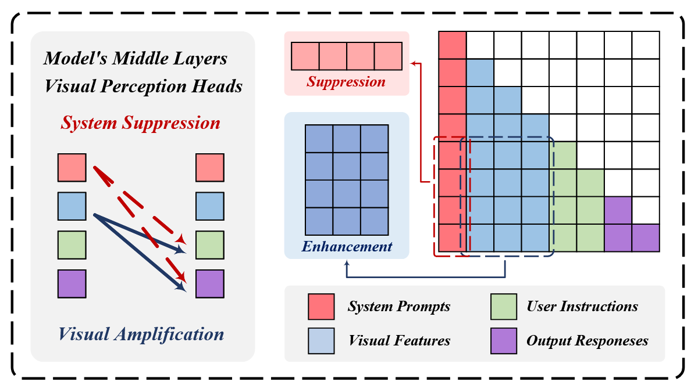

# ClearSight

虽然 training-free 的**对比解码**策略例如 VCD，能够有效地缓解多模态大模型幻觉，但是对比解码存在着一些显著的缺点，包括：（1）每次解码都需要模型两次前向传播，降低了推理效率；（2）对比解码损害了大模型的生成能力。多模态融合主要位于**中间层**，论文提出一种 training-free 的幻觉缓解方法：VAF(Visual Amplification Fusion)，通过**增强视觉** tokens 的注意力分数，同时**降低系统提示** tokens 的注意力分数，VAF 有效地降低了幻觉现象，同时保持了推理效率。

**注**：关于对比解码以及视觉对比解码的内容，请见 [VCD.md](./VCD.md)。


## 方法

VAF 方法如下图所示，包含两个方面：（1）增强视觉 tokens 的注意力分数；（2）降低系统提示 tokens 的注意力分数。数学表达式如下：

```math
\hat{Z}_{l,h}=Z_{l,h}+\alpha \cdot M_{l,h}^{enh}\circ Z_{l,h}-\beta\cdot M_{l,h}^{sup}\circ Z_{l,h}
```

其中， $Z_{l,h}$ 为 **Softmax 前**的注意力分数矩阵， $M_{l,h}^{enh}$ 表示增强部分的掩码， $M_{l,h}^{sup}$ 表示衰减部分的掩码， $\alpha$ 表示**增强系数**， $\beta$ 表示**衰减系数**。默认的参数设定为： $\alpha=0.1,\beta=0.15$ 。




## Reference

1. [ClearSight: Visual Signal Enhancement for Object Hallucination Mitigation in Multimodal Large language Models](https://arxiv.org/abs/2503.13107) (Mar. 17, 2025, **CVPR 2025**) [](https://arxiv.org/abs/2503.13107)[](https://github.com/ustc-hyin/ClearSight)