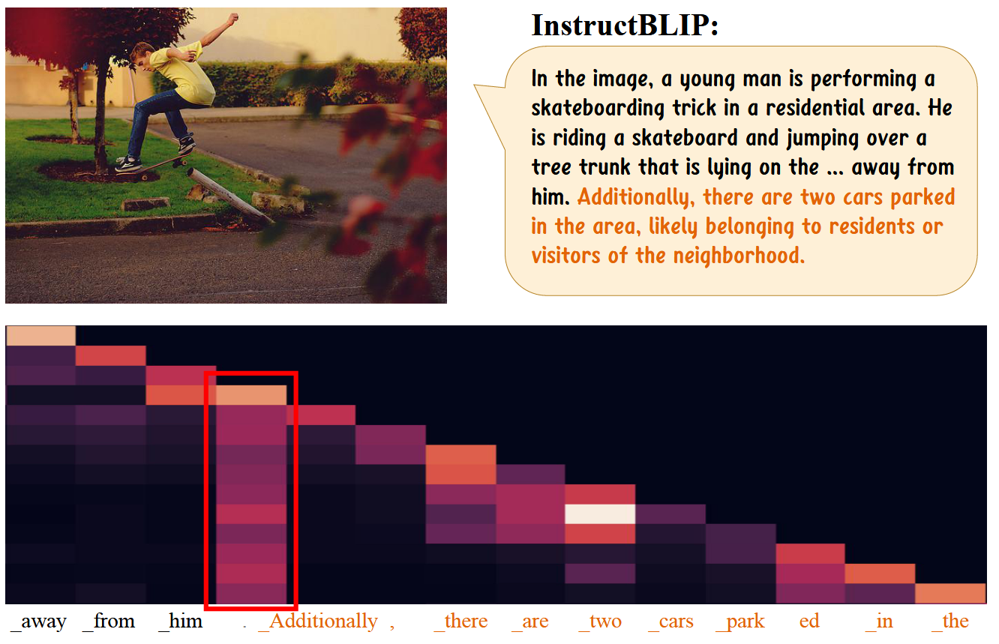
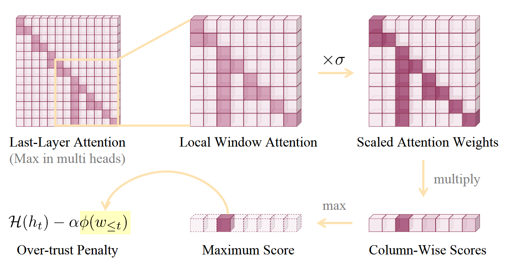
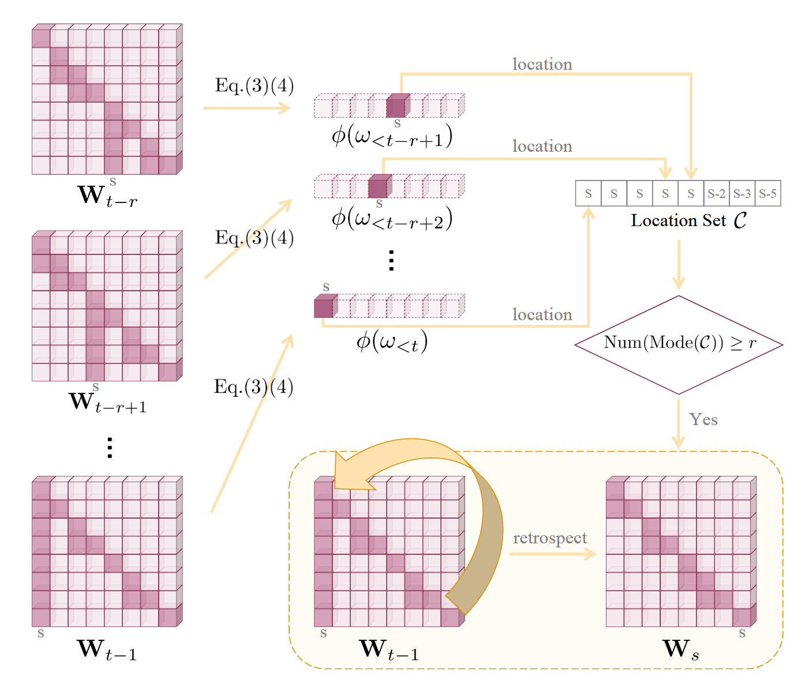

# OPERA

OPERA 是缓解多模态大模型的经典方法之一，作者发现大多数幻觉现象与**知识聚集模式**紧密关联，其中知识聚集模式表示在自回归生成过程中，多模态大模型通常为少量总结性 tokens 分配大量的注意力，对于其他 tokens 的注意力偏低。这种**过度依赖总结性 tokens** 的倾向导致多模态大模型容易忽略图像 tokens，因此提高了发生幻觉的概率。OPERA 基于 **Beam Search** 解码方法，包含两个方面：（1）**过度依赖惩罚**；（2）**回滚策略**。


## 知识聚集现象

**知识聚集**（Knowledge Aggregation）表示在自回归生成过程中，多模态大模型通常为**少量总结性 tokens** 分配大量的注意力，对于其他 tokens 的注意力偏低。以下案例展现了一个知识聚集模式，句号后的 tokens 对前面的**句号**分配的注意力相对较高，形成了一种“**列式注意力**”现象，而后面生成的 tokens 出现了幻觉。

这些总结性 tokens 通常是一些**不包含实际语义信息的标点符号**，出现知识聚集现象后，容易产生幻觉。**知识聚集现象** 似乎是 Transformer 结构的特点，不仅体现在大模型，甚至在 ViT(Vision Transformer) 也存在这些现象。




## 方法

OPERA 通过**过度依赖惩罚**（Over-Trust Penalty）以及**回滚策略**缓解多模态大模型的知识聚集现象，从而缓解幻觉。假设多模态大模型的输入为：

```math
\begin{aligned}
X_v&=\set{x_0,x_1,\dots,x_{m-1}}\newline
X_t&=\set{x_{m},x_{m+1},\dots,x_{m+n-1}}\newline
X&=[X_v,X_t]=\set{x_1,x_2,\dots,x_{m+n}}
\end{aligned}
```

其中 $X_v$ 和 $X_t$ 分别表示视觉 tokens 和文本 tokens，忽略系统提示 tokens 以保持简洁性。 $X$ 作为大模型的输入进行自回归生成，每生成一个 token 将其附加到 $X$ 中作为下一次大模型的输入，直到生成遇到 [EOS] token 或者达到最大长度为止。模型的前向传播过程如下， $h$ 表示多模态大模型**最后一层输出的隐藏层状态**（hidden states）

```math
h=\text{MLLM}(x_i),h=\set{h_0,h_1,\dots,h_{t-1}}
```

然后使用一个线性投影层 $H$ 将 last token 投影到词表空间 $V$ ，通过 softmax 得到一个概率分布：

```math
p(x_t\vert x_{\lt t})=\text{Softmax}(H(h_t))_{x_t},x_t\in V
```


### 过度依赖惩罚

OPERA 是一个基于 Beam Search 的解码方法，在解码的过程中，会引入一个过度依赖惩罚，过程如下图所示。考虑一个不包括输入的视觉和文本 tokens 的**局部窗口**，首先，对此窗口的因果注意力矩阵进行预处理，包括**填充对角线上方值为零**、**缩放注意力值**、**多头注意力中沿注意力头取最大值**。其次，按列求注意力值的乘积（对角线下方）并计算最大值 $\phi(w\le t)$ ，概率分布变为：

```math
p(x_t\vert x_{\lt t})=\text{Softmax}(H(h_t)-\alpha\phi(w\le t))_{x_t}
```

通过上述惩罚操作，能够有效地降低某些词的概率值，即降低了模型对某些词的 confidence。



**注**：缩放注意力值是一个必要的操作，因此注意力分数通常比较低（小于 1），计算累乘分数时，若不进行缩放，导致**数量多列的累乘值偏低**，**数量少的列累乘值偏高**，**难以检测知识聚集模式**。因此我们可以通过缩放，将里面的每一个元素值缩放到 1 左右，累乘操作后的规模接近。


### 回滚策略

基于上述对知识聚集模式的检测方式，OPERA 在一个局部窗口内维护一个数组，用于判断在生成过程中产生的知识聚集现象，数组的每一个值记录了在生成对应 token 的过程时关注度最高的总结性 tokens 位置，若数组内包含超过 $r$ 个**相同值**，那么进行一次回滚操作，回滚到对应的总结性 tokens 位置，选择一个新的 token 继续自回归生成过程。

**注**：同一个位置的回滚次数有一个最大值 $\beta$ 的限制。




## Reference

1. [OPERA: Alleviating Hallucination in Multi-Modal Large Language Models via Over-Trust Penalty and Retrospection-Allocation](https://arxiv.org/abs/2311.17911) (Nov. 29, 2023, **CVPR 2024**)[](https://arxiv.org/abs/2311.17911)[](https://github.com/shikiw/OPERA)

