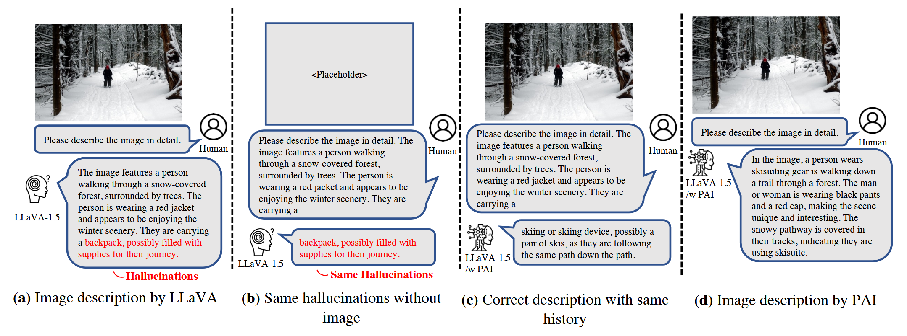
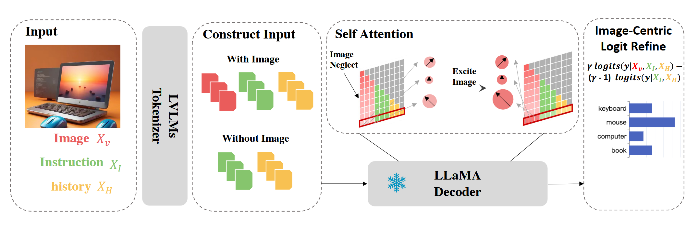

# PAI

多模态大模型进行自回归生成时，可能会**过度依赖于已经生成的文本**，忽略图片，从而生成与不符合图片的幻觉内容，这种现象称为 “**文本惯性**“，这种现象本质上源于大模型强大的**语言先验**。PAI 与**视觉对比解码**（VCD）都通过**对比解码**（Contrastive Decoding）降低大模型对于语言的依赖性，从而缓解幻觉，而 PAI 除了对比解码，还通过**提升视觉注意力**使大模型**更加关注图片**的内容，使大模型生成的内容更加符合图片事实。

## 文本惯性

下面的例子阐述了多模态大模型中的 “**文本惯性**” 现象。具体而言，给定一张图片，要求 LLaVA 对其进行详细描述，得到一段**包含幻觉的文本**，将产生幻觉之前的文本响应重新输入到大模型中，并且不输入对应的图片，LLaVA 仍然输出**相同的结果**，说明大模型在生成这一段幻觉文本时**几乎完全依赖于已生成的文本**，没有关注对应的图片信息。

## 方法

为了缓解 “**文本惯性**” 现象，作者提出 PAI(Pay Attention To Image)，包含两个部分：

1. **图像注意力增强**：生成每个 token 的过程中，在特定层中增强图像的注意力，具体公式如下：
   $$
   \widetilde{A}_{t,k}=\widetilde{A}_{t,k}+\alpha\times\vert\widetilde{A}_{t,k}\vert
   $$
   
   其中 $k$ 表示图像 tokens 的下标。
   
2. **视觉对比解码**：类似于 VCD，可以理解为 VCD 的一种**特殊情况**，即另一个分支的输入是一个**完全高斯噪声**的图片，这里 PAI 采取的是直接不输入对应的图片。通过对比解码的方式对 logits 进行细化，具体公式如下：
   $$
   \gamma logit(y\vert X_v,X_I,X_H)-(\gamma-1)logit(y\vert X_I,X_H)
   $$
   

**注**：这里和原始对比解码公式是**等价**的，只需要令 $\gamma=1+\alpha$ 代入上述公式即可。

通过 PAI 可以降低大模型的语言先验，缓解 “**文本惯性**” 现象，从而缓解了多模态大模型的幻觉现象。

## Reference

1. [Paying More Attention to Image: A Training-Free Method for Alleviating Hallucination in LVLMs](https://arxiv.org/abs/2407.21771v1) (Jul. 31, 2024, **ECCV 2024**)
2. [Mitigating Object Hallucinations in Large Vision-Language Models through Visual Contrastive Decoding](https://arxiv.org/abs/2311.16922) (Nov. 28, 2023, **CVPR 2024**)

