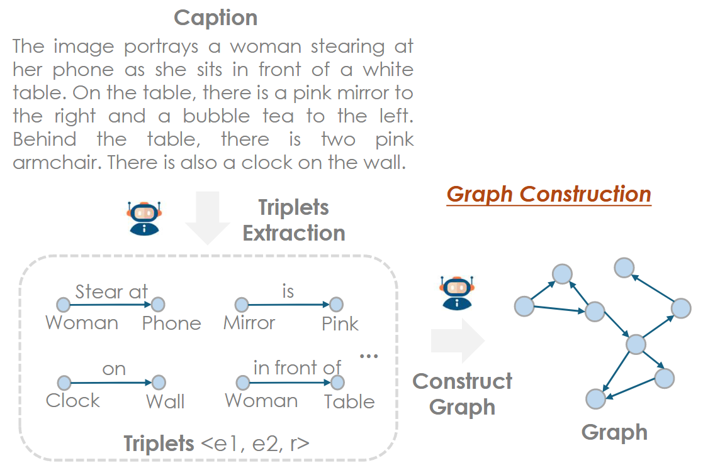

# PerturboLLaVA

PerturboLLaVA 旨在缓解多模态大模型在**图像文本描述**任务的幻觉，利用**扰动视觉训练**，使多模态大模型更加关注图像内容，从而缓解了大模型强大的语言先验，生成文本响应基于输入的图像，因此有效地缓解了幻觉。此外，作者提出了一个新的**细粒度**幻觉指标 **HalFScore**，用于衡量多模态大模型在图像文本描述任务幻觉程度，利用 GPT4 生成文本描述的**语言图**（Language Graph），图的节点代表物体，边代表物体之间的关系，通过与 Ground Truth 语言图进行**匹配**，匹配度越高，幻觉程度越低。


## HalFScore

CHAIR 指标广泛应用于衡量多模态大模型在图像文本描述任务中的幻觉程度，CHAIR 指标包含两个变体： $\text{CHAIR}s$ 和 $\text{CHAIR}i$ ，分别衡量句子级别和实例级别幻觉，数学表达式如下：

```math
\text{CHIAR}s=\frac{|\lbrace\text{hallucinated objects}\rbrace|}{|\lbrace\text{all objects mentioned}\rbrace|},\text{CHIAR}i=\frac{|\lbrace\text{sentences with hallucinated object}\rbrace|}{|\lbrace\text{all sentences}\rbrace|}


```

虽然 CHAIR 指标是一个简单有效的衡量物体幻觉程度的指标，但是其**缺乏细粒度的幻觉程度评价能力**，例如：物体属性和物体关系幻觉。因此，作者提出一个细粒度幻觉评价指标：HalFScore，具体而言，利用 GPT **构造文本描述的语言图**，语言图的节点代表物体，边代表物体之间的关系，与 Ground Truth 语言图进行匹配，计算 Precision 和 Recall 指标，计算公式如下：

```math
\text{Precision}=\frac{\left\vert C_{\text{gen}} \cap C_{\text{gt}} \right\vert}{\left\vert C_{\text{gen}}\right\vert}=1-\frac{\left\vert C_{\text{hallucinated}}\right\vert}{\left\vert C_{\text{gen}} \right\vert},\text{Recall}=\frac{\left\vert C_{\text{gen}} \cap C_{\text{gt}} \right\vert}{\left\vert C_{\text{gt}} \right\vert}=1-\frac{\left\vert C_{\text{omitted}}\right\vert}{\left\vert C_{\text{gt}} \right\vert}
```

根据 Precision 和 Recall 指标，通过如下公式计算 HalFScore：

```math
\text{HalFScore}=2\times\frac{\text{Precision}\times\text{Recall}}{\text{Precision}+\text{Recall}}
```

由此可见，HalFScore **本质上是一个 F1 Score**，可以将匹配任务视为**二分类任务**，将**语言图的匹配（重叠）部分视为 TP(True Positive)，将幻觉部分视为 FP(False Positive)，将忽略的部分视为 FN(False Negative)**。


HalFScore 的关键是构建语言图，通过 GPT-4o 对文本描述进行分析，提取里面的每个物体以及物体之间的关系，形成一系列结构化的**三元组**，一般的形式为：(Obj1, Obj2, R)，其中 Obj1 和 Obj2 表示两个物体，R 表示 Obj1 与 Obj2 的关系。此外，对于**物体属性的描述**也是一个三元组，(Obj, A, R)，其中 Obj 表示物体，A 表示物体属性，R 表示物体与属性的关系。




## 扰动视觉训练

为了缓解多模态大模型强大的语言先验，作者提出**扰动视觉训练**（Perturbative Visual Training）方法。为了进行扰动视觉训练，首先需要构造一个特定的数据集，具体而言，对于每一个样本，利用 GPT 生成**扰动文本**（Perturbative Text），通常**与图片相关、符合常识，但是与图片事实不符**的文本，用于模拟大模型的的语言先验。扰动文本能有效地放大大模型的语言先验，误导大模型产生幻觉，通过语言建模损失训练大模型，**迫使大模型更加关注视觉信息**，从而在一定程度上缓解了语言先验，因此有效地缓解幻觉现象。


**注意**：扰动文本仅在训练时添加，在推理阶段不包含扰动文本。


## Reference

1. [PerturboLLaVA: Reducing Multimodal Hallucinations with Perturbative Visual Training](http://arxiv.org/abs/2503.06486) (Mar. 9, 2025, **ICLR 2025**)[](http://arxiv.org/abs/2503.06486)