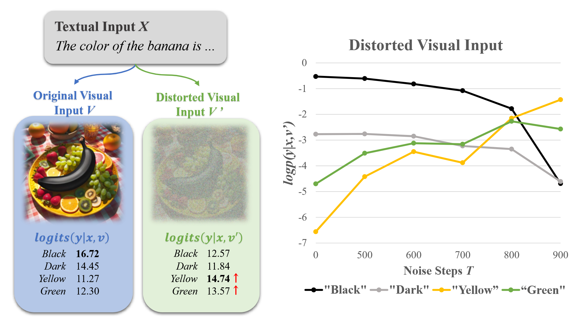
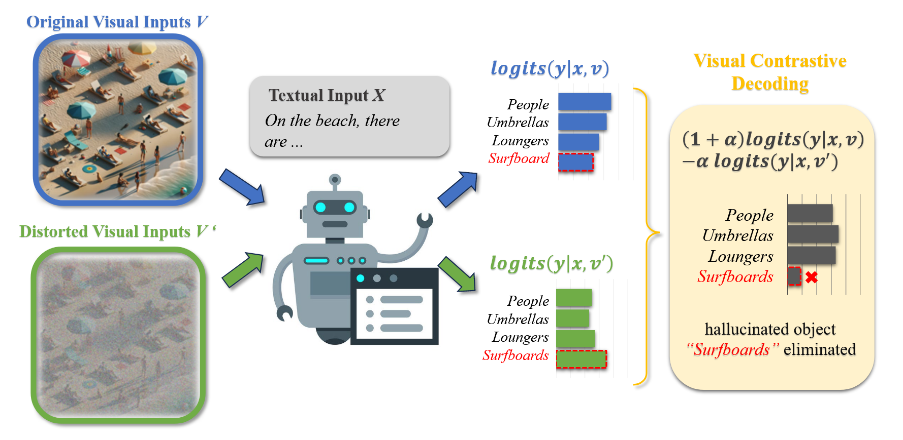

# VCD

Visual Contrastive Decoding(VCD) 是一种**对比解码**的方法，研究者发现多模态大模型幻觉的其中一个原因是**大模型具备强大的语言先验知识**，VCD 通过视觉对比解码来降低 LLM 的语言先验，有效地缓解了幻觉现象。具体来说，通过对比原始分支以及对图片**添加高斯噪声**的分支的 logits，本质上是通过**降低模型的语言先验**，避免大模型过度依赖语言先验，从而忽视视觉信息，进而产生偏离图像的幻觉shu'chu。

## 对比解码

**对比解码**（Contrastive Decoding）是一种用于缓解**多模态大模型**（Multimodal Large Language Models）幻觉的解码策略。对比解码指的是对比两个输出的 logits，从而得到一个校正后的 logits，在一定程度上可以缓解幻觉现象。除了原始的输入之外，为了得到两个 logits，对比解码通常还有一个容易产生幻觉的输入，这在原始输入的基础上**添加扰动**（Perturbation）得到的。在多模态大模型中，对比解码的数学表达式为：

$$
p_{cd}(y|v,x,v',x')=\text{softmax}[(1+\alpha)\text{logit}_\theta(y|v,x)-\alpha \text{logit}_\theta(y|v',x')]
$$

其中，$v$、$v'$ 表示原始和扰动后的视觉信号，$x$、$x'$ 分别表示原始和扰动后的文本输入，$\alpha\ge0$ 为**校正强度系数**。

在对比解码中，还存在一个**自适应可靠性限制**（Adaptive Plausibility Constraint），用来**限制词表的空间**，其数学表达式如下：

$$
\text{V}_{\text{head}}(y_{\lt t})=\{ y_t \in \text{V}: p_\theta(y_t|v,x,y_{\lt t})\ge \beta \max_{w}p_\theta(w|v,x,y_{\lt t}) \}
$$

其中，$0\le \beta \le 1$ 用来控制词表的**截断程度**，$\beta$ 越大则倾向于输出概率较高的词。

在施加可靠性限制后， 会进一步调整输出的概率分布，使不在 $\text{V}_{\text{head}}(y_{\lt t})$ 的词概率为 0：

$$
p_{cd}(y_t|v,x,v',x')=0, \text{if } y_t \notin \text{V}_{\text{head}}(y_{\lt t})
$$

在实现自适应可靠性限制时，需要对 `next_token_logits` 进行 **softmax** 操作以获得 $p_\theta(y_t|v,x,v',x')$，可以通过不等式的恒等变换，转换为修改 `next_token_logits` 达到相同的效果。具体推导过程如下：

$$
\begin{align}&p_\theta(y_t|v,x,y_{\lt t})\ge \beta \max_{w}p_\theta(w|v,x,y_{\lt t})\newline&\Leftrightarrow\log[p_\theta(y_t|v,x,y_{\lt t})]\ge \log\beta+ \max_{w} \log[p_\theta(w|v,x,y_{\lt t})]\newline&\Leftrightarrow \log\frac{\exp(\text{logit}_\theta(y_t|v,x,y_{\lt t}))}{\sum_j\exp(\text{logit}_\theta(y_j|v,x,y_{\lt t})))}\ge\log\beta+\max_{w}\log\frac{\exp(\text{logit}_\theta(w|v,x,y_{\lt t}))}{\sum_j\exp(\text{logit}_\theta(y_j|v,x,y_{\lt t})))}\newline&\Leftrightarrow \text{logit}_\theta(y_t|v,x,y_{\lt t})\ge\log\beta+ \max_{w}\text{logit}_\theta(w|v,x,y_{\lt t})\end{align}
$$

因此，可得到一个 **cutoff** 为 $\log\beta+ \max_{w}\text{logit}_\theta(w|v,x,y_{\lt t})$，将 `next_token_logits` 中小于 cutoff 的词对应的 logit 替换为 `float("-inf")` 即可使得这些词在 softmax 操作后概率为 0，从而达到相同的目的。

> 对比解码的优点👍在于它是一种 **training-free** 的方法，但缺点😟在于其推理的代价是原来的 2 倍，因为需要在 LLM 中进行两次 forward pass。

## 视觉对比解码

作者做了一个实验，对于一张包含黑色香蕉的图片，对图像进行类似于扩散模型的扩散过程，即逐步添加随机高斯噪声，发现随着噪声强度的提高，模型输出 “black” 的 logits 降低，输出 “yellow” 和 “green“ 的 logits 不断升高，说明视觉不确定性随着视觉噪声强度提高而提高，大模型会根据自身强大的先验知识生成幻觉答案。

VCD 通过对原始图片添加**高斯噪声**，得到一张扰动图片，降低大模型对图片的感知，使其依赖于模型的语言先验知识。通过对比两个分支的输出 logits，进而得到一个更好的 logits（**降低模型的语言先验**），最后应用自适应可靠性限制消除不太可能生成的词。

## Reference

1. [Mitigating Object Hallucinations in Large Vision-Language Models through Visual Contrastive Decoding](https://arxiv.org/abs/2311.16922) (Nov. 28, 2023, **CVPR 2024**)
2. [Contrastive Decoding: Open-ended Text Generation as Optimization](http://arxiv.org/abs/2210.15097) (Jul. 10, 2023, **ACL 2023**)

